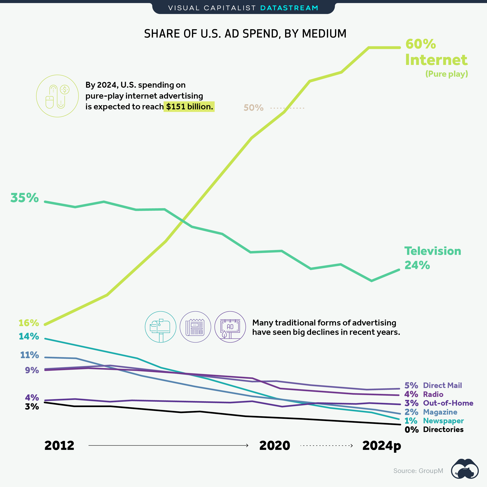
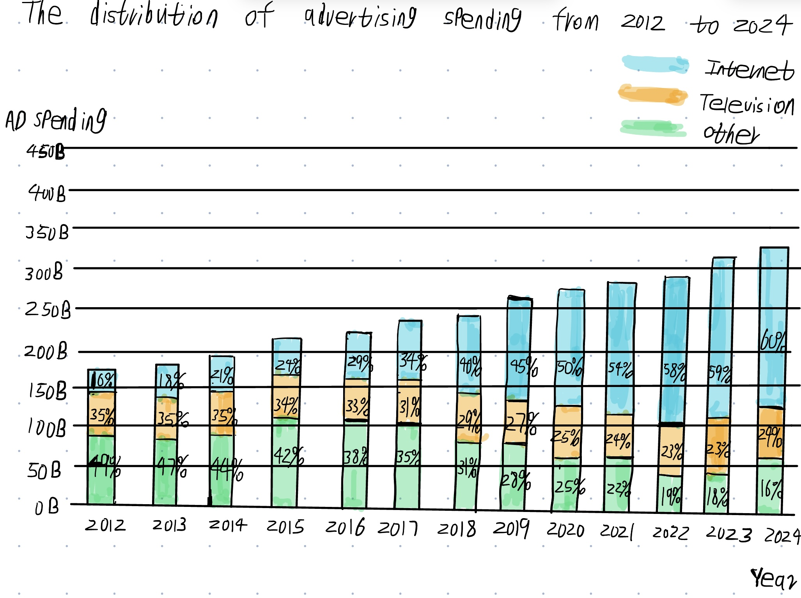

# Critique by Design with Tableau (MakeoverMonday)

## Step one: the visualization

Link to the original data visualization: https://www.visualcapitalist.com/majority-advertising-dollars-spent-online/

Screenshoot of the original data visualization: 

The resaon I selected this data visualization is that advertsing is very important for many tech companies. The advertising spending accounts for a very high proportion of many companies' spending, through redesigning this data visualization, we can find which advertising method is more popular in recent years and help companies find the best advertising method to promote their products. 

## Step two: the critique

 ### The summary of critique

This data visualization used line charts to display the trend of the proportion of different types of advertising expenditure. Through line charts, I can clearly understand the popularity of which advertising method has increased significantly in recent years. But this data visualization also had many disadvantages. For example, using proportion may be less intuitive than using numbers. Although we can understand which advertising method has become more popular, it’s difficult for us to understand the growth range or decline range in spending for each advertising method. To improve it, I would use the numbers to replace the proportion as the advertising spending and add an increase or decline ratio to the chart which will help us understand the changing situation of different advertising methods’ spending better. 

I think the primary audience for this tool is advertising agencies or advertisers. I think this data visualization may give these audiences some insights, but not very effective for reaching that audience. Because when advertising agencies or advertisers advertise the product, they need to know the specific numbers of different advertising methods’ spending. If only based on the proportion, they can’t confirm the overall advertising spending of this year. In addition, advertising agencies always focus on the popular advertising methods, some less attracting advertising methods may not be very useful for them.

I think this method is successful at evaluating the data visualization. Because it focuses on many different aspects to help us know if it is easier for audiences to understand the main topic of data visualization. The first change to this data visualization is the color. The colors of some advertising methods such as Direct Mail ,Radio and Out-of-home are very close which make it difficult for audiences to distinguish them. We can use more contrasting colors to represent different advertising methods. The second change is the type of visualization. In this line chart, we can see some lines are crossing together which is difficult for audiences to check out the specific numbers. I would change the line chart to the bar chart, through bar charts, we can separate the spending of each advertising method in every year which is clearer for our audiences to understand. 

## Step three: Sketch a solution

 The wireframe: 

  In this wireframe, I used a bar chart to replace a line chart to help audiences see the advertising spending more clearly. At the same time, I grouped some not-very-popular advertising methods into a specific advertising method called "Other". In this way, it will be easier for audiences such as advertising companies or advertisers to find which advertising method has become more and more popular in recent years.
 
## Step four: Test the solution

 ### The summary of user feedback:

Interviewer 1: A CMU Student, mid 20's

Questions: 1.What do you think is the theme of this data visualization?

This data visualization may be about how the expenditure of different advertising methods changes over time. It seems that the Internet will be the most popular advertising method in 2024.

2.Who do you think is the intended audience for this data visualization?

The intended audiences may be some advertisers who want to promote their products through the Internet, television and other ways.

3.Is there anything that confuses you about this data visualization?

I’m just confused that ‘other’ specifically refers to which types of advertising methods. The proportion of ‘Other’ from 2012 to 2016 is relatively high, so I’m curious about what advertising methods are included in it. 

4.What do you think could be improved with this data visualization? 

Everything seems good. I just want to split the ‘Other’ into some more specific advertising methods. I think there will be some useful insights we can get from it.
         
         
Interviewer 2: An adult, late 40's

Questions: 1.What do you think is the theme of this data visualization?

I think it can tell me which advertising methods have become more and more popular and which advertising methods have shown significant declines in popularity. 
             
2.Who do you think is the intended audience for this data visualization?

I think the intended audiences will be the advertising companies. They will be interested in which advertising methods are more popular in recent years.
            
3.Is there anything that confuses you about this data visualization?

The one thing I’m confused about is why this visualization shows every year’s advertising spending distribution. In some years, the proportion of the Internet does not seem to increase significantly. In addition, through this visualization I can’t understand the increase or decline ratio of each advertising method’s spending, because it’s a proportion not a specific number. 
            
4.What do you think could be improved with this data visualization?

To improve this data visualization, I think you can just contrast each advertising method’s spending between 2012 and 2024, and use the specific number to calculate the increase or decline ratio of advertising spending. I think it’s a great way to help me and other audiences to quickly understand which advertising method spending increases significantly. 

 ### Synthesis: 

  Through these feedbacks, I learned that when we create a data visualization, we need to carefully think about who will be the intended audiences for this data visualization. Different audiences will have different goals to use data visualization, we need to make the content of our visualizations clearly understood by different types of audiences.  

## Step five: build the solution

Through all the feedbacks, I think there are three important design changes I can make in my final redesign. 

1. I can split the advertising method ‘Other’ into many specific methods which will help audiences contrast other advertising methods with television/Internet to have a better understanding of some traditional advertising forms that have already declined. 
2. I can decline the number of years, and just contrast the result between 2012 and 2024. Through this change, the increase of Internet advertising spending will become more obvious. 
3. Instead of using proportion as the label, I will use the specific number as the label and add an increase or decline ratio for each advertising method. Through this way, audiences can get a more intuitive sense of how spending is changing across different advertising methods. 

 ### My final solution:

 
<noscript></noscript><object class='tableauViz'  style='display:none;'><param name='host_url' value='https%3A%2F%2Fpublic.tableau.com%2F' /> <param name='embed_code_version' value='3' /> <param name='site_root' value='' /><param name='name' value='MakeoverMondayWeek46-TheGrowthofInternetAdSpend-2020vs2012_17267008163900&#47;FinalRedesignBarChart' /><param name='tabs' value='no' /><param name='toolbar' value='yes' /><param name='static_image' value='https:&#47;&#47;public.tableau.com&#47;static&#47;images&#47;Ma&#47;MakeoverMondayWeek46-TheGrowthofInternetAdSpend-2020vs2012_17267008163900&#47;FinalRedesignBarChart&#47;1.png' /> <param name='animate_transition' value='yes' /><param name='display_static_image' value='yes' /><param name='display_spinner' value='yes' /><param name='display_overlay' value='yes' /><param name='display_count' value='yes' /><param name='language' value='en-US' /><param name='filter' value='publish=yes' /></object>
                
 

 In my final solution, I use a bar chart to contrast the different advertising methods' spending in 2012 and 2024. I chose this data visualization to help intended audiences understand the increase or decline situation in different advertising methods' spending, which will help them choose the most effective ways to advertise their products. Compared to previous data visualization, I added a line to display the increase or decline ratio of each advertising method's spending. 

 ### Reference:
 Link to the Watch Me Viz video: https://www.youtube.com/watch?v=uJxVKJYLS_o&list=PLX-uPHRG0cLb697Ie-ZGSObRLLNhxzJGK&index=127

