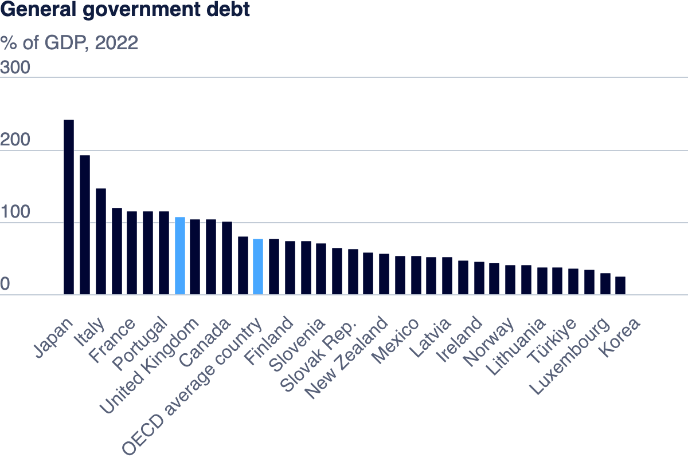

# Portfolio
This is my public portfolio for Telling Stories with Data at CMU!  Here's where all my cool work will go. You should probably hire me. 

# About me
Hi! My name is Ziyi Shan. My pronouns are he or his. I’m in the MISM-BIDA 16 months program. This is my second year in Pittsburgh. In my daily life, I would like to spend time reading, watching sporting competitions and playing video games. 

# What I hope to learn
Through this course, I hope to learn how to use data to identify problems in a technology company's operations, find out the causes of the problems, and help the company develop strategies to solve the problems. At the same time, I would like to acquire some skills to enhance the aesthetics of data visualization, which will help me create clearer and more accurate visualization boards and reports for future reporting and presentation. After graduation, I would like to become a data analyst or data scientist to assist in decision making from a data perspective to help the company gain greater benefits. What I have learned in this course will be very useful in my future interviews and jobs to improve my data visualization skills.

# Portfolio

## Assignment: [Visualizing government Debt](visualizing-government-debt.md)

           

<noscript></noscript><object class='tableauViz'  style='display:none;'><param name='host_url' value='https%3A%2F%2Fpublic.tableau.com%2F' /> <param name='embed_code_version' value='3' /> <param name='site_root' value='' /><param name='name' value='GeneralGovernmentdebt_1&#47;GeneralGovernmentdebt' /><param name='tabs' value='no' /><param name='toolbar' value='yes' /><param name='static_image' value='https:&#47;&#47;public.tableau.com&#47;static&#47;images&#47;Ge&#47;GeneralGovernmentdebt_1&#47;GeneralGovernmentdebt&#47;1.png' /> <param name='animate_transition' value='yes' /><param name='display_static_image' value='yes' /><param name='display_spinner' value='yes' /><param name='display_overlay' value='yes' /><param name='display_count' value='yes' /><param name='language' value='zh-CN' /><param name='filter' value='publish=yes' /></object>
                

## Assignment 3&4: [Critique by Design](critique-by-design.md)

## Final project
[Part I](final-project-part-one.md)
[Part II](final-project-part-two.md)
[Part III](final-project-part-three.md)

### Adding images
Here's an example of how to add an image to my portfolio.

### Setting up a separate page

Here's an example of how to link to another page using Markdown.

[link to other page](dataviz1.md)

