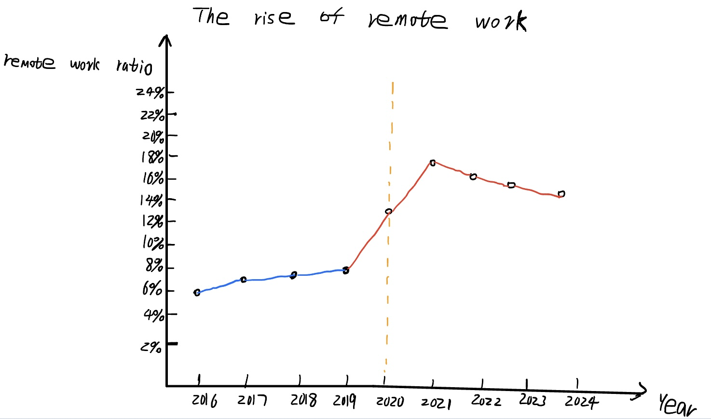
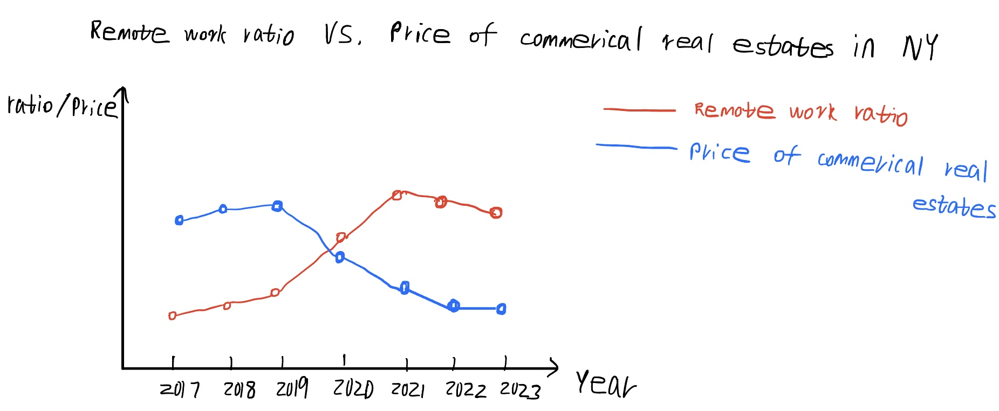
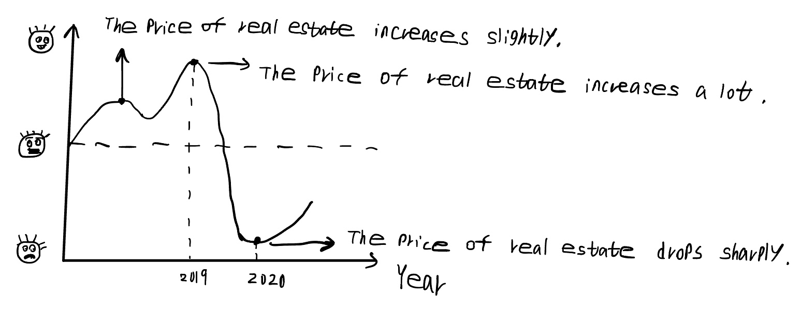

| [home page](https://dashuai77.github.io/Portfolio/) | [visualizing government debt](visualizing-government-debt.md) | [critique by design](Critique-by-Design-with-Tableau.md) | [final project I](final-project-part-one-Ziyi.md) | [final project II](final-project-part-two-Ziyi.md) | [final project III](final-project-part-three-Ziyi.md) |
# Final project Part one

## Topic

The impact of remote work on the real estate economy

## Outline
### A high-level summary of project

In recent years, especially after the COVID-19 pandemic, remote work has gradually turned into an increasingly popular trend, with more and more companies announcing remote work as a mainstream work form. Compared with traditional work forms, remote work has many obvious advantages. For example, remote work can significantly improve the efficiency of employees and make them work-life balance. Employees don't need to spend a lot of time commuting every day, they can just stay at home to complete their work which will improve their job satisfaction and quality of life. In addition, remote work can help companies reduce the cost of leasing commercial office buildings, companies can choose smaller office spaces as well as shared spaces for their employees to finish their work. In conclusion, remote work has already had a huge impact on every aspect of our society. In this project, I want to focus on showing what I think is the most important impact of remote work, and that’s on the real estate economy. Through analyzing how remote work affects different types of real estate, we can help our audiences make better investment decisions. 

### A project structure 

1. The rise of remote work
   
Since the COVID-19 pandemic, the rate of remote working in lots of industries has risen substantially. And many companies, especially tech companies, announced that they will implement remote work completely. 
  
2. Some benefits of remote work for employees and companies
   
For employees, remote work gives them a work-life balance. They don’t need to go to their office and they can just stay at home and spend time with their family which will improve their quality of life.

For companies, remote work helps them save much money by leasing expensive commercial office buildings. They can just use smaller spaces to help employees finish their work.

3. The impact of remote work on the real estate economy
   
3.1 The impact of remote work on residential real estate
   
Due to the benefit of remote work for employees, employees don’t need to consider the restrictions of the workplace, they may choose cheaper, larger, and quieter suburban homes as their options. Demand for these suburban homes will increase dramatically, the price of these suburban residential real estate will also rise sharply. 
  
3.2 The impact of remote work on commercial real estate
   
Due to the benefit of remote work for companies, they will not spend much money to lease commercial office buildings. As a result, the price of many commercial real estate, especially in large cities such as New York or Los Angeles, will decline dramatically. 
  
4. Based on these impacts, helping our intended audiences such as buyers, sellers and real estate investors make wise decisions
   
When making real estate investments, investors should consider the impact of remote work. When the remote work ratio is higher or lower in one region, they need to make a more careful decision about investing in real estate. 

## Initial sketches

The rise of remote work: 

The impact of remote work on commerical real estate: 

The impact of remote work on investors : 

## The data

### Data source: 

My data source is mainly the U.S. Bureau of Labor Statistics. On this website, I can get the dataset about the number and percentage of people teleworking by demographic characteristics and job characteristics. 

I will use this data to create a line chart and check out the trend of remote work ratio in recent years. Then I will use this data to create a map and check out which states have the most remote workers. By contrasting the price of real estate and the remote work ratio in each state, I can understand the impacts of remote work on real estate. 
  
### A link to the publicly-accessible datasets:

| Name | URL | Description |
|------|-----|-------------|
|  %Working from home in each state.csv | https://github.com/dashuai77/Portfolio/blob/main/%25%20working-from-home-in-each-state.csv | The remote workers ratio in each state |
|  telework-tables-2023-06.xlsx | https://github.com/dashuai77/Portfolio/blob/main/telework-tables-2023-06.xlsx |   Telework situation in June 2023 |

## Method and medium

To complete my final project, I will use Tableau to create data visualizations, some dashboards and a story. Through creating a story in Tableau, I can show the topic of my final project in a more logical way which will help me audiences understand what I hope to achieve in this project.

